# (60%) 113-2 Web 程式設計一 期中 mid1 -- 斷網考試

##### 2025-04-09, at E201, from 18:20~20:50

#### Note:

1. mid1 是斷網考試，mid2 是開放網路考試，如果 mid1 題目已經完成 (p1_68, p2_68, p3_68)，可以開始做 mid2 題目不須網路的部分 (p4_68)
2. 請不要發揮同學愛，作弊雙方除了本次考試 0 分外，平常分數另扣 20 分，情節嚴重者會送校。
3. iClass 上請繳交 md_68.pdf, md_mid1.zip(md 壓縮檔), mid1_68.zip (code 壓縮檔)，壓縮前請將 node_modules 全部砍掉
4. 請直接將答案寫在 md_mid1_68/md_68.md 上，老師出題及圖片放在 md_htc.pdf 上，請依照老師所給的圖片來實作並標註
5. 跟期中考相關的檔案及目錄名稱有 68 時，必須要改成學號後 2 碼，沒有修改時，會視違犯情況扣分。
6. 每一張圖片要有機房左側背景，圖片上要有你的學號(或後兩碼)，圖片標註要跟老師所標註的類似。違者會依情節扣分。
7. 請自評分數，將每一題的 ? 填入分數，沒有填者，不會批改，以 0 分計算。

##### Your (Name, ID): (劉政霆, 212410368)

Mid1: 60% 斷網

- P1 (20%): 15 分
- P2 (15%): 10 分
- P3 (15%): 10 分
- P4 (10%): 10 分

Mid2: 40% 開放網路

- P5 (10%): 10 分
- P6 (10%): 10 分
- P7 (20%): 10 分

##### 總分: 75 分

---

## Mid1: 60%

### (20%) P1: 實作 mid1 考試所需要的選單及選項

##### => 檔案目錄

##### => Chrome 顯示，根路由頁面

##### => Chrome 顯示 路由 /mid1_68

##### => Chrome 顯示路由 /mid1_68/p1_68

#### Your Answer

##### => 檔案目錄

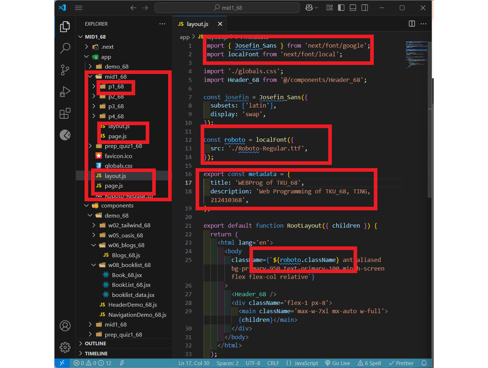

##### => Chrome 顯示，根路由頁面

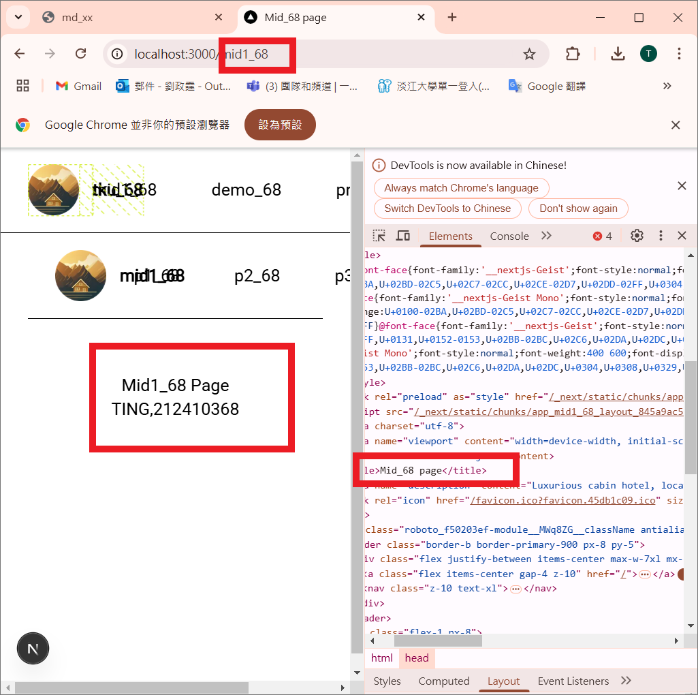

##### => 跟目錄之 page.js, layout.js code 重點截圖

##### => Chrome 顯示 路由 /mid1_68

##### => /mid1_68 目錄之 page.js, layout.js code 重點截圖

##### => /mid1_68 下之 HeaderMid1_68, NavigationMid1_68.js code 重點截圖

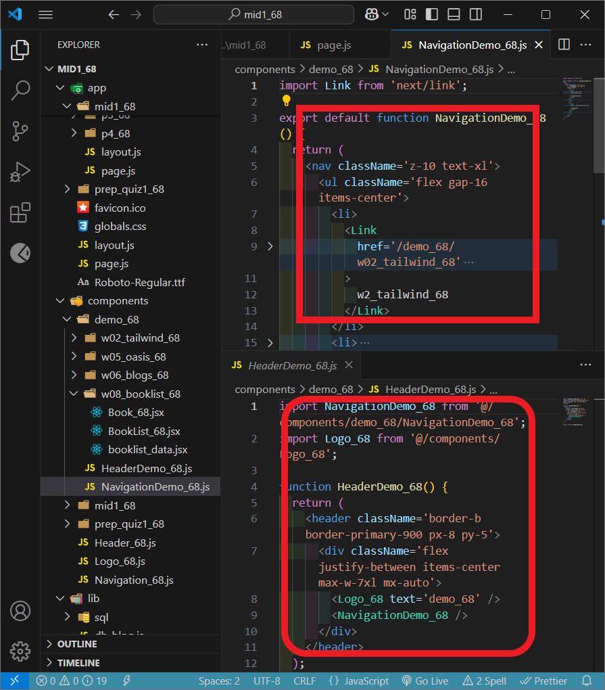

##### => Chrome 顯示路由 /mid1_68/p1_68

---

### (15%) P2: 實作 p2_68，點選 p1_68，顯示 Tours 靜態頁面

請使用 components/mid1_68/p2_68/tour_theme 來回答本問題，css 之 wrapper 老師已經建立，放在 styles/wrappers/mid1_68/Tours.jsx 中

請將 theme 中的 index.html 內容的 5 個 tours 直接放入 mid1_68/p1_68/page.js 中，並能以靜態頁面顯示 5 個 tours

所有 tours 圖片，請放入 public/mid1 中

##### => 會用到的檔案目錄

##### => Chrome 顯示

#### Your Answer

##### => 檔案目錄

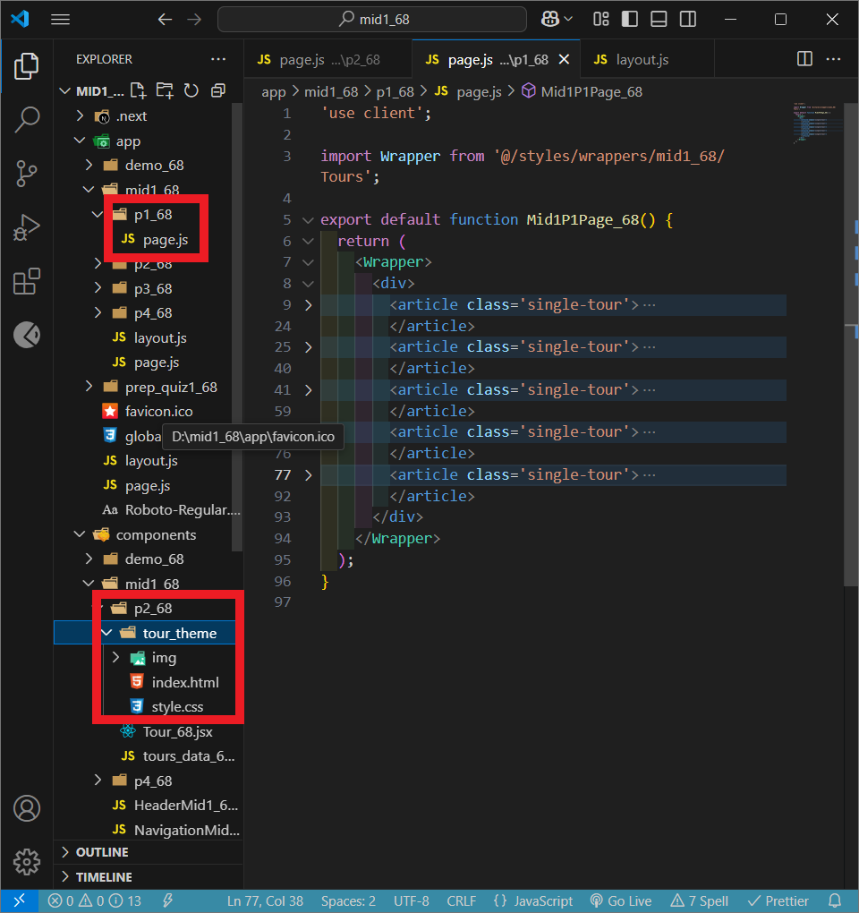

##### => Chrome 顯示

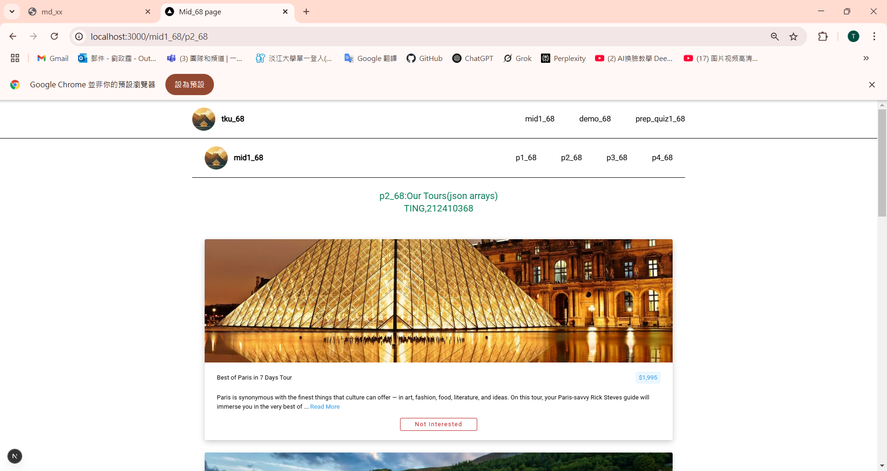

##### => page.js 之 code 修改重點

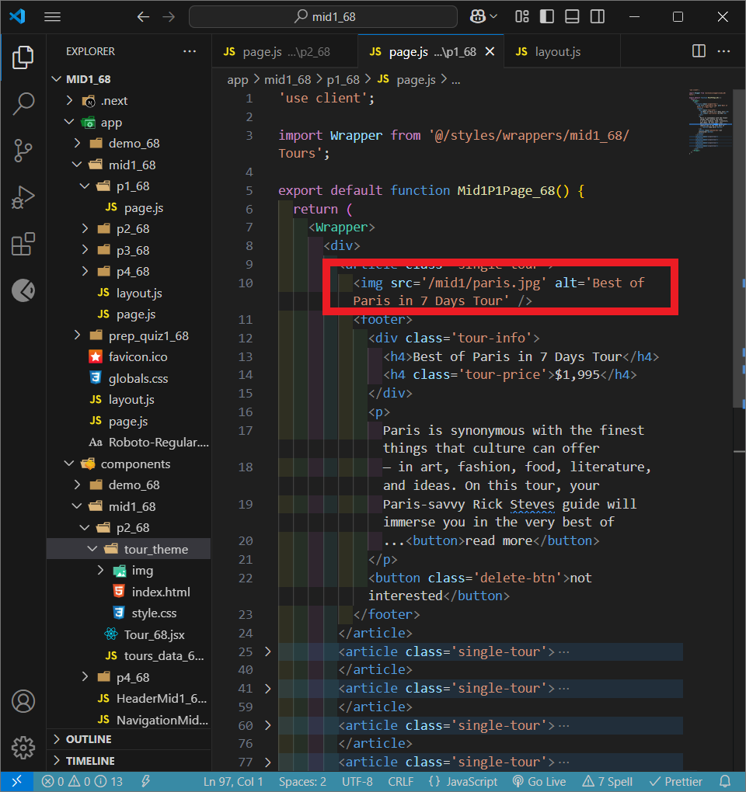

---

### (15%) P3: 實作 p2_68，將 P2 改成透過 json array 來顯示 tours

page.js 請在最上一行，加入 'use client'，變成 client component

將 P2 之 5 個 tours 放入 tours_data_68.js 之 tours_68 陣列中，並透過 page.js 將 tours_68 陣列將每一筆 tour 資訊 讀入，每一個 tour 資訊則透過 Tours_68.jsx 來顯示

tours_68 陣列中的內容，請以下面 Chrome 截圖相關資訊來實作，圖圖片要有 img, remote_img, img 紀錄 local 圖片路徑，remote_img 紀錄放在 Supabase storage 圖片的路徑

##### => 檔案目錄

##### => Chrome 顯示

#### Your Answer

##### => 檔案目錄

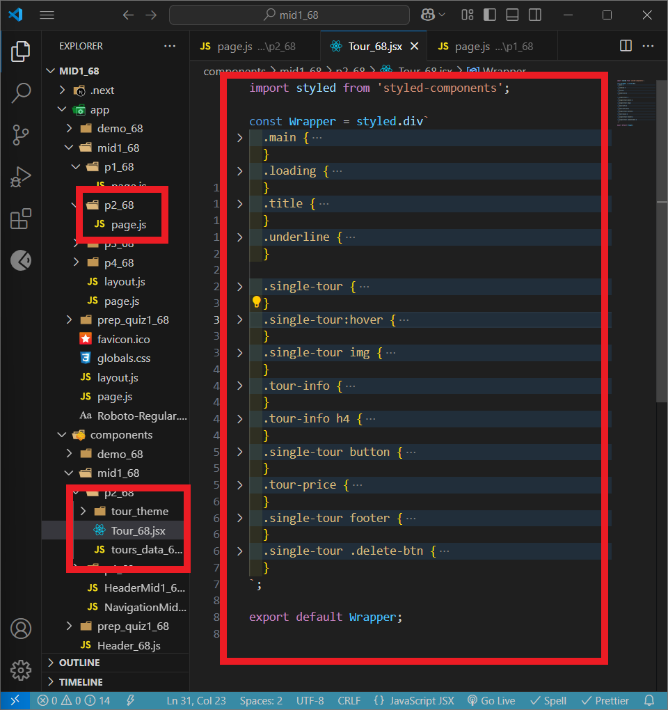

##### => Chrome 顯示

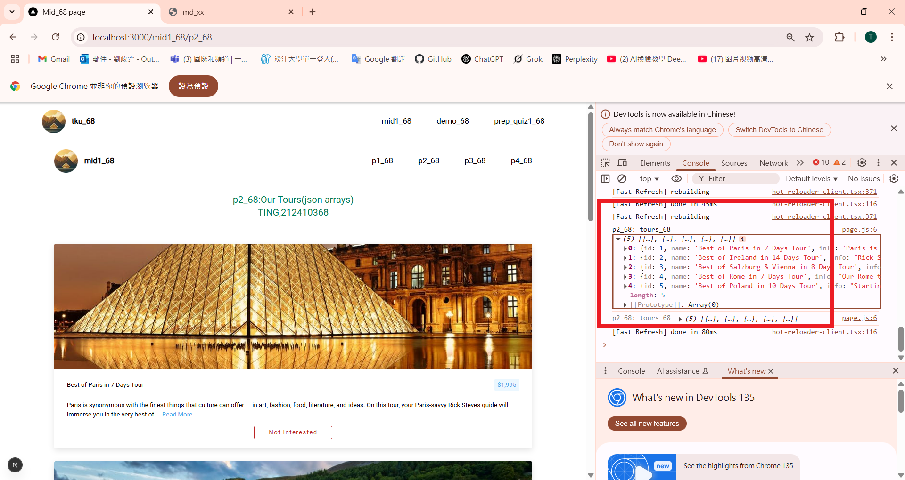

##### => page.js 之 code 重點截圖

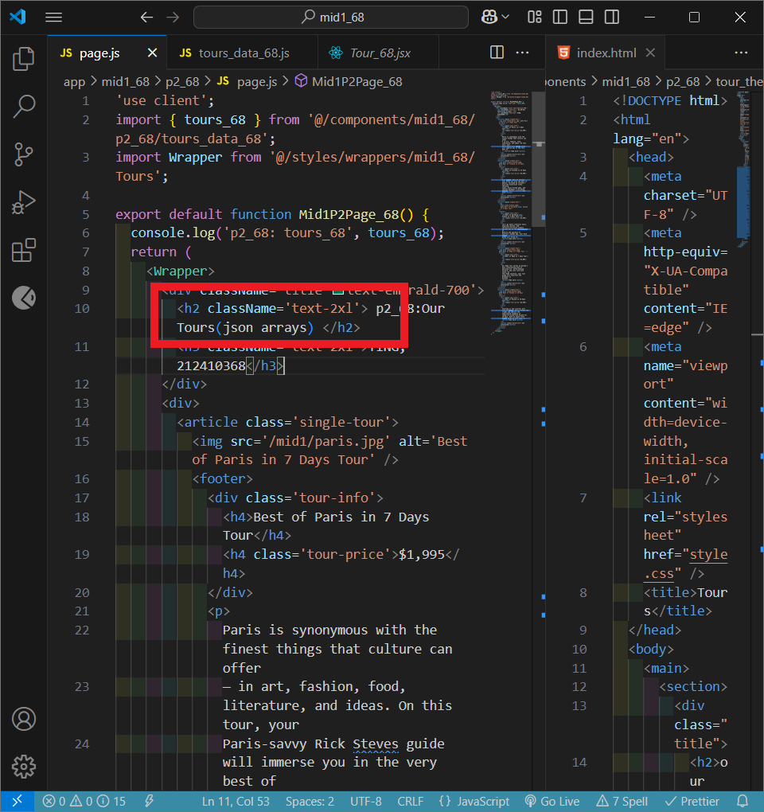

##### => Tour_68.js 之 code 重點截圖

---

### (10%) P4: 實作 p3_68，呈現上課 demo The Wild Oasis 中的 About 頁面

##### => 會用到的檔案目錄

##### => Chrome 顯示 About 頁面

#### Your Answer

##### => 會用到的檔案目錄

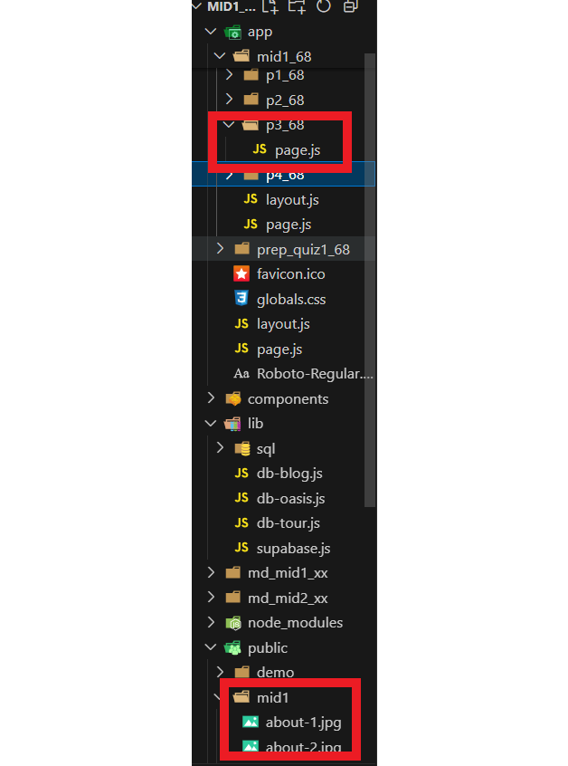

##### => Chrome 顯示 About 頁面

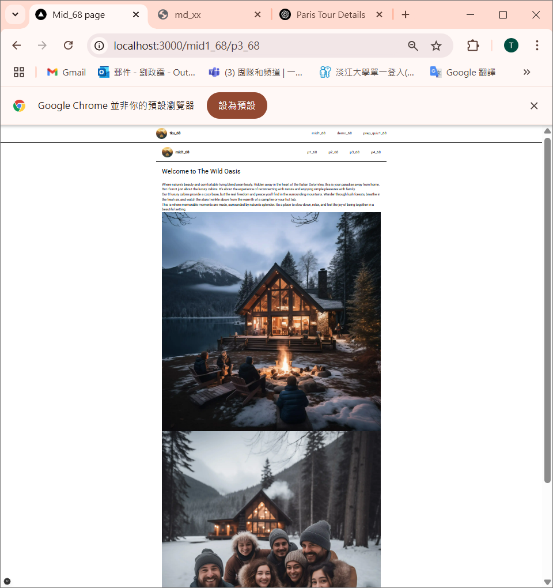

##### => 相關 code 之截圖

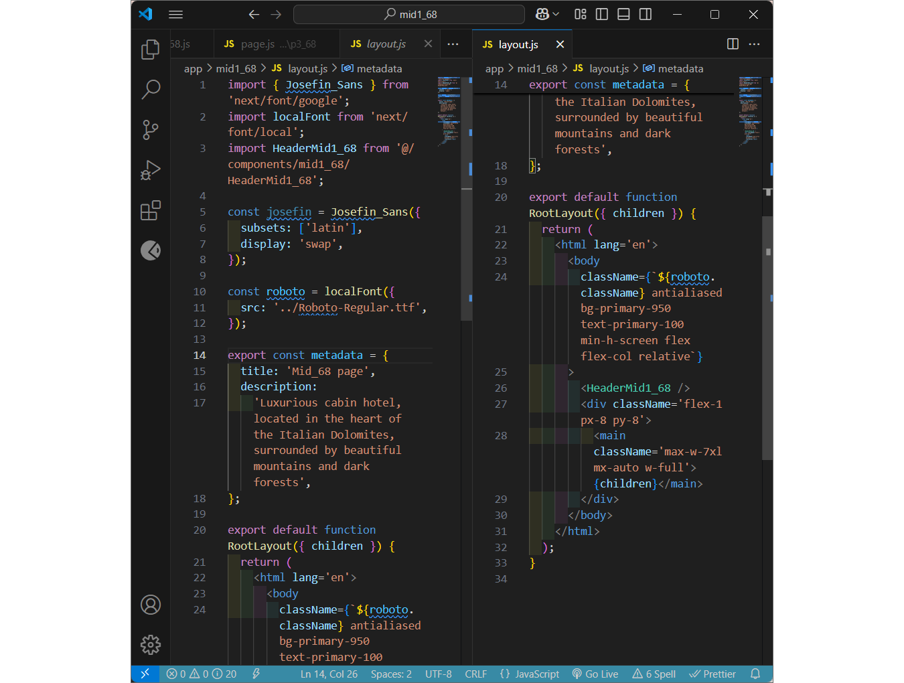

---
